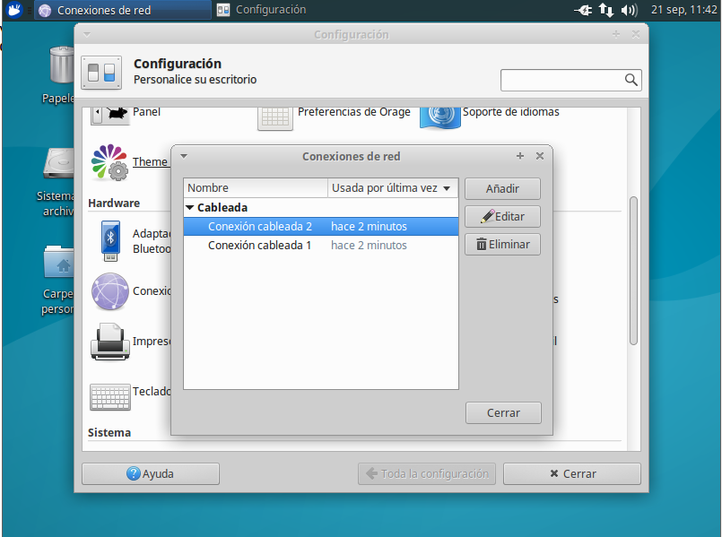
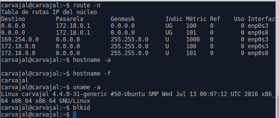
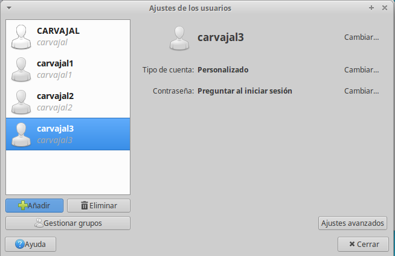
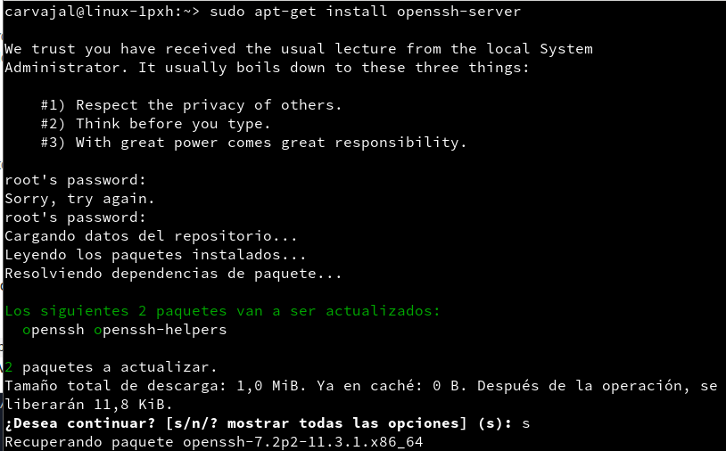
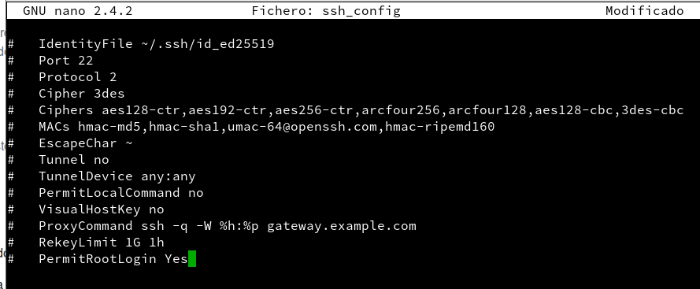
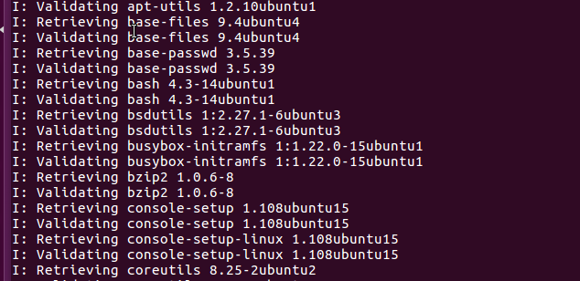
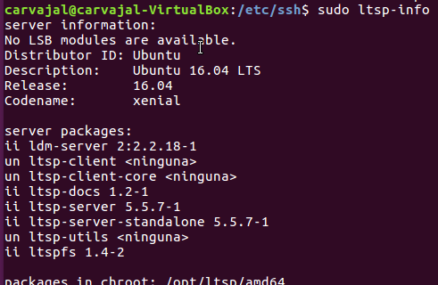
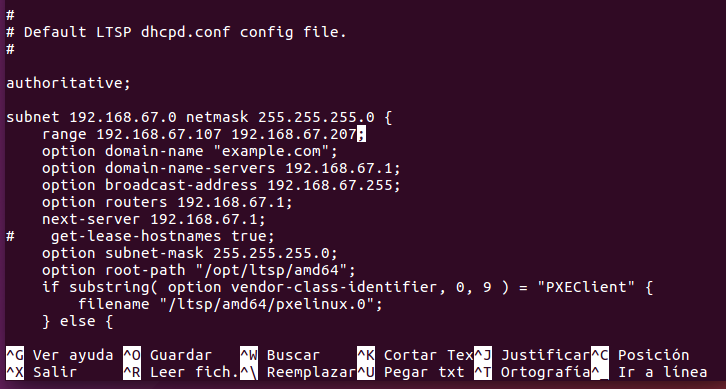
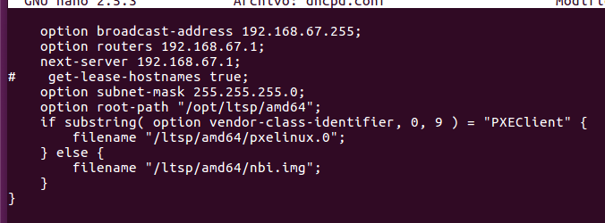
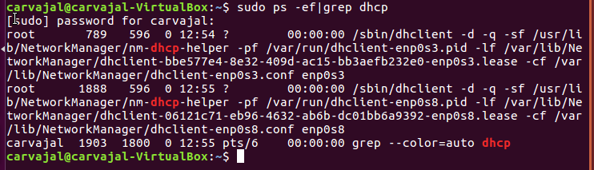

# Clientes Ligeros

El primer paso para nuestra práctica será configurar las redes.
Una de ellas nos servirá para comunicarnos con el exterior y la otra, como red interna para trabajar con los demás ordenadores.

Introducimos unos comandos para observar que todo marcha.

El siguiente paso es crear usuarios para nuestro sistema.

Ahora nosotros debemos instalar el openssh-server en nuestra máquina virtual.

El siguiente paso cuando esté instalado es llegar al "archivo ssh_config" e insertar una línea más con el comando "PermitRootLogin Yes".

Después de esto reiniciamos el ordenador para verificar los cambios. Ahora instalaremos el servicio de clientes ligeros con "lts-server-standalone".

El siguiente comando a introducir será "ltsp-build-client" para crear nuestro servidor ltsp. Tardará un rato.

Después consultaremos la información de la instalación.

Ahora revisaremos la configuración del LTSP con DHCP.
Consultaremos el fichero de configuración "/etc/ltsp/dhcpd.conf" y cambiaremos unas rutas en amd64 como aparece en la siguiente imagen.

Cambiamos las rutas de amd64.

En la imagen anterior también hay que modificar el valor "range [ip]" por nuestro puesto.

- Reiniciamos el servidor y comprobamos que los servicios van bien.

