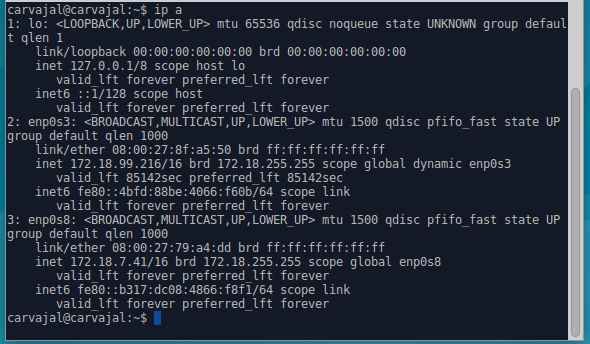
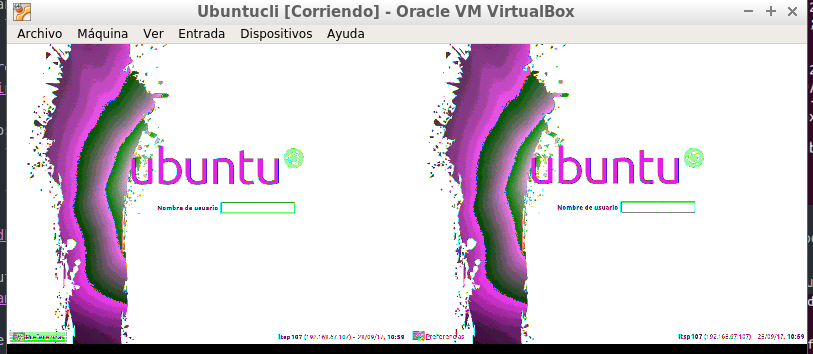

# Configuración de SSH y LTSP

El primer paso para nuestra práctica será configurar las redes.
 Una de ellas nos servirá para comunicarnos con el exterior y la otra, como red interna para trabajar con los demás ordenadores.
 

 Introducimos unos comandos para observar que todo marcha.

 El siguiente paso es crear usuarios para nuestro sistema.

 Ahora nosotros debemos instalar el openssh-server en nuestra máquina virtual.

 El siguiente paso cuando esté instalado es llegar al "archivo ssh_config" e insertar una línea más con el comando "PermitRootLogin Yes".

El siguiente comando a introducir será ltsp-build-client para crear nuestro servidor ltsp. Tardará un rato.
+Después de esto reiniciamos el ordenador para verificar los cambios. Ahora instalaremos el servicio de clientes ligeros con "lts-server-standalone".

El siguiente comando a introducir será "ltsp-build-client" para crear nuestro servidor ltsp. Tardará un rato.

Después consultaremos la información de la instalación.

 Ahora revisaremos la configuración del LTSP con DHCP.
Consultaremos el fichero de configuración /etc/ltsp/dhcpd.conf y cambiaremos unas rutas en amd64 como aparece en la siguiente imagen. Consultaremos el fichero de configuración "/etc/ltsp/dhcpd.conf" y cambiaremos unas rutas en amd64 como aparece en la siguiente imagen.

 Cambiamos las rutas de amd64.

En la imagen anterior también hay que modificar el valor "range [ip]" por nuestro puesto.

Reiniciamos el servidor y comprobamos que los servicios van bien.

### Como último paso
debemos verificar que la máquina virtual cliente se conecta con el servidor. Para ello debemos crear otra máquina virtual sin disco duro y arrancar el cliente desde red/PXE.

- Es importante destacar que no es lo mismo la memoria RAM que la memoria de vídeo de la MV. Debemos poner al máximo la memoria de vídeo y la configuración normal de la RAM.

- También es necesario que la red interna esté bien debido a que el cliente se conecta por red interna y, al estar las dos máquinas funcionando, en la pantalla del cliente debe aparecer la imagen de ubuntu conseguida del servidor.

Al final aparecerá esto en la pantalla del cliente.

`Aparecen dos ventanas y se desconoce el por qué aparece de esta manera.`
