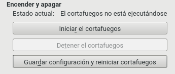
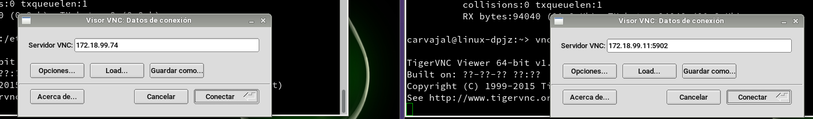
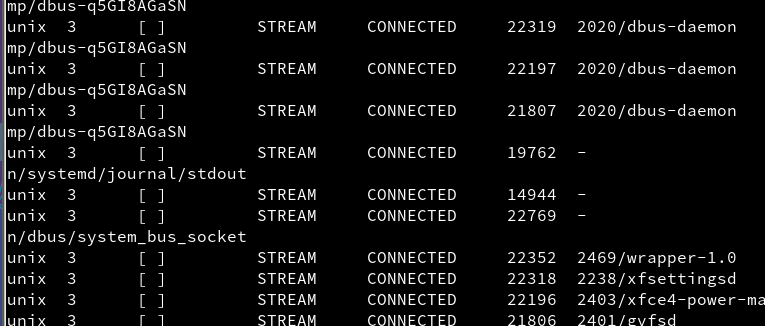
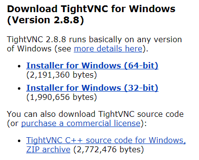
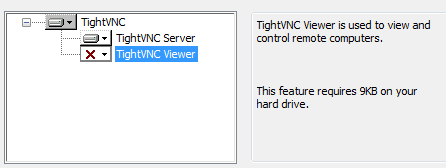
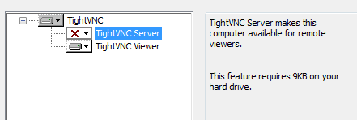
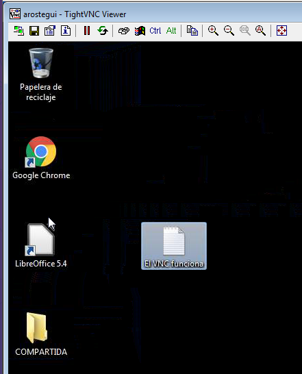
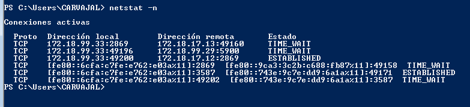

# Práctica de VNC

### VNC en OpenSuse

Lo primero que necesitamos instalar en OpenSUSE desde `Yast -> VNC`

Permitimos la administración remota y el cortafuegos por la guía facilitada.

Aparecerá un mensaje de que faltan algunos componentes y que habrá que instalarlos.

Al acabar la instalación se deberá reiniciar el sistema.

Si aparecen problemas para poder usar el VNC debeŕiamos desactivar el cortafuegos.

Ejecutamos el comando `vncviewer` desde el terminal y las dos pantallas se verían.

Como último paso ejecutamos `netstat -p` en la terminal para examinar las direcciones.

### VNC en Windows

Vamos a instalar un servicio VNC en una máquina Windows. Lo primero que haremos será instalar un programa llamado `TightVNC`

La siguiente parte es importante por que en la máquina servidor necesitamos instalar `SOLAMENTE` el modo servidor.

Una vez instalado nos vamos a la MV del cliente e instalamos `SOLAMENTE`  el `Viewer`.

Cuando haya concluído, iniciamos las dos máquinas virtuales y encendemos ambos programas. Aparcerá una pantalla que nos pedirá la IP de la máquina remota y, automáticamente, podremos observar la otra máquina.

Como última medida, insertamos el último comando en la `PowerShell` El comando es `netstat -n` y permite observar las IPs.

### VNC de Windows a OpenSUSE

Vamos a hacer una prueba de cómo funcionaría el VNC desde Windows a OpenSUSE.
