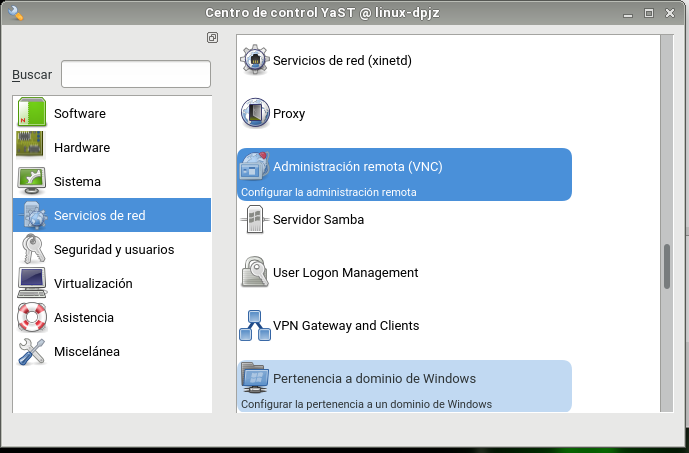
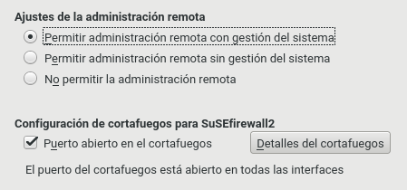
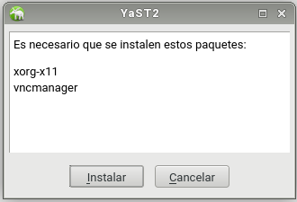
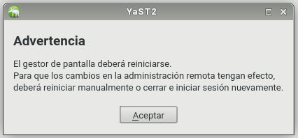

# Práctica de VNC

### VNC en OpenSuse

Lo primero que necesitamos instalar en OpenSUSE desde `Yast -> VNC`

Permitimos la administración remota y el cortafuegos por la guía facilitada.

Aparecerá un mensaje de que faltan algunos componentes y que habrá que instalarlos.

Al acabar la instalación se deberá reiniciar el sistema.

### VNC en Windows

Vamos a instalar un servicio VNC en una máquina Windows. Lo primero que haremos será
