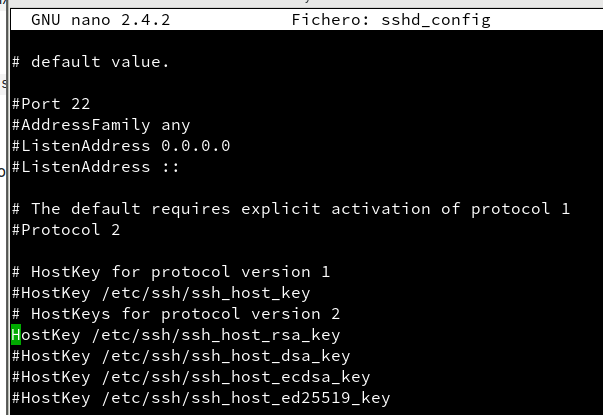

# Acceso remoto con SSH

Vamos a necesitar para esta práctica tres máquinas virtuales.

* Una máquina **OpenSUSE** servidor.

* Una máquina **OpenSUSE** cliente.

* Una máquina **Windows** cliente.

Lo primero que debemos hacer es tener nuestra máquina SUSE servidor con estas especificaciones.

En nuestra máquina SUSE servidor necesitaremos mostrar los siguientes comandos mostrados en pantalla para comprobar cambios.

En el servidor crearemos distintos usuarios.

A continuación instalaremos el **openssh** en nuestra máquina virtual.

Insertando un `sudo systemctl status sshd` observamos el estado de nuestro servicio.

Con `ps -ef|grep sshd` comprobamos los servicios del sistema.

El siguiente comando es `netstat -ntap` para comprobar que el servicio tiene el puerto 22 en funcionamiento en tcp y openssh. Si esto no funciona hay que bajar un momento el cortafuegos.

Hacemos `ssh [ip-del-servidor]` para verificar que las máquinas se ven entre ellas.

### ¿Y si cambiamos las claves del servidor?

Confirmamos que existen ficheros en `/etc/ssh` y debemos ver que existen `ssh_host*key` y `ssh_host*key.pub`.

Vamos a configurar el `sshd_config` y dejamos una única línea `HostKey /etc/ssh/ssh_host_rsa_key`. Debemos destildar esa línea.

Vamos a regenerar nuevas claves para la identificación de nuestro servidor. Para ello, escribimos el comando **a continuación**.

Reiniciamos el servicio SSH.

Y ahora comprobamos que el servicio está en ejecución.

Ahora vamos a personalizar el **bash** en la máquina servidor. Debemos entrar al usuario **carvajal1**, en nuestro caso, y añadir estas lineas a continuación descritas.

Terminado este paso, creamos el fichero **.alias** descrito en la misma ruta de la foto con el siguiente contenido.

Nuestro siguiente paso será de configurar SSH para poder acceder desde el cliente1. **Primero** debemos entrar en ssh-clint7a. **Luego** ejecutamos el comando a continuación. Junto con el comando de crear una llave vemos el contenido de la nueva llave.

Insertamos la nueva llave en el usuario4 de nuestra máquina para permitirle entrar al sistema sin necesidad de password.

### Uso del SSH como túnel para x
