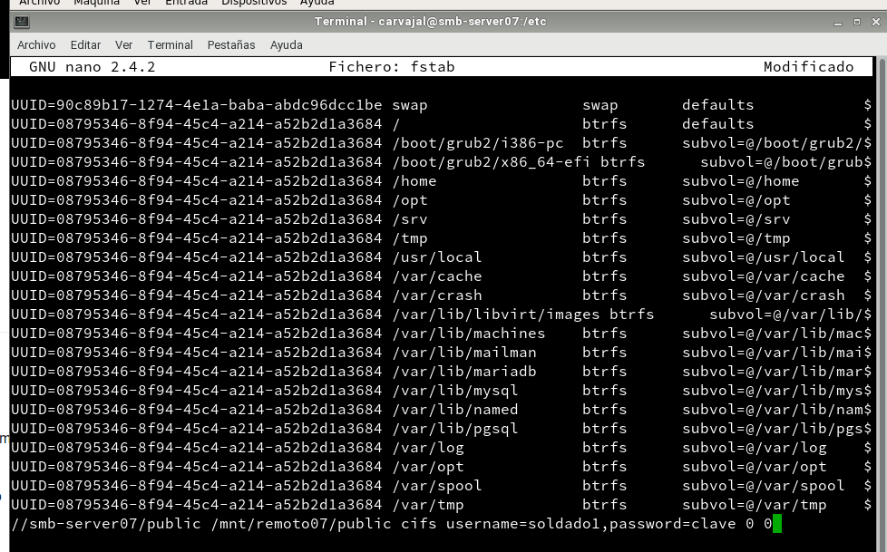
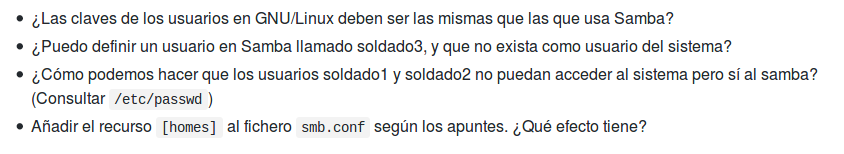

# Samba

Vamos a necesitar dos máquinas virtuales:

* OpenSUSE (cliente y servidor)

* Windows 7/10

## 1. Servidor Samba (MV1)

#### 1.1 Preparativos

Teniendo esto empezamos nuestra práctica con unos comandos iniciales.

#### 1.2 Usuarios locales

Nuestro siguiente paso es crear usuarios en el servidor de OpenSUSE. Vamos a crear los grupos `soldados`, `piratas` y los usuarios correspondientes para los grupos como `supersamba` y `smbguest`.

Terminado ese paso procederemos a crear un fichero `samba07` con las carpetas `barcos`, `castillo`, `public`.

Después, usando el comando `scp` para crear una copia de seguridad.

Ahora vamos a configurar el servidor Samba desde el Yast.

Ahora debemos ir a `Recursos compartidos` y crear recursos llamados `public` y `cdrom`.

#### 1.3 Crear las carpetas para los futuros recursos compartidos

Abrimos una consola para comprobar los resultados con el comando `testparm`.

Ahora comprobamos la lista de usuarios Samba.

Lo siguiente es reiniciar el servicio para valorar los cambios. Se puede hacer por método gráfico.

Unos comandos de comprobación.

Una vez en Windows, nos conectamos al servidor Samba y observamos que tenemos acceso a nuestras carpetas.

Comprobamos resultados.

Observamos las conexiones abiertas.

Volviendo a Linux, mostraremos todos los recursos y equipos.

Ahora iremos al fichero de `fstab` para conseguir un montaje automático.

Por último en el informe, ordenadamente, se solucionan unas preguntas.

* No, no deben ser las mismas por un tema de seguridad.

* Si no está vinculado con los ficheros de configuración es como si no existiera.

* A partir de la configuración de `/etc/passwd`.

* El efecto que tiene es que ahora todos tienen acceso a Samba con y sin contraseña.
