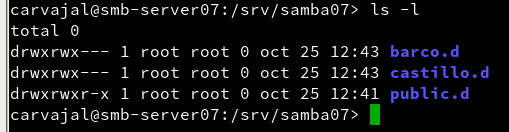

# Samba

Vamos a necesitar dos máquinas virtuales:

* OpenSUSE (cliente y servidor)

* Windows 7/10

Teniendo esto empezamos nuestra práctica con unos comandos iniciales.

Nuestro siguiente paso es crear usuarios en el servidor de OpenSUSE. Vamos a crear los grupos `soldados`, `piratas` y los usuarios correspondientes para los grupos como `supersamba` y `smbguest`.

Terminado ese paso procederemos a crear un fichero `samba07` con las carpetas `barcos`, `castillo`, `public`.

