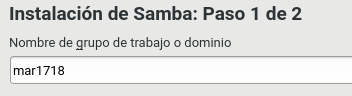

# Samba

Vamos a necesitar dos máquinas virtuales:

* OpenSUSE (cliente y servidor)

* Windows 7/10

## 1. Servidor Samba (MV1)

#### 1.1 Preparativos

Teniendo esto empezamos nuestra práctica con unos comandos iniciales.

#### 1.2 Usuarios locales

Nuestro siguiente paso es crear usuarios en el servidor de OpenSUSE. Vamos a crear los grupos `soldados`, `piratas` y los usuarios correspondientes para los grupos como `supersamba` y `smbguest`.

Terminado ese paso procederemos a crear un fichero `samba07` con las carpetas `barcos`, `castillo`, `public`.

Ahora vamos a configurar el servidor Samba desde el Yast.

#### 1.3 Crear las carpetas para los futuros recursos compartidos

Ahora debemos ir a `Recursos compartidos` y crear recursos llamados `public` y `cdrom`.

#### 1.4 Configurar el servidor Samba

Usando el comando `cp`, vamos a crear una copia de seguridad.

Vamos a ir a `Yast -> Samba Server` para hacer unos cambios.

#### 1.5 Crear los recursos compartidos de Samba

Vamos a los archivos de Samba para configurar el archivo.

Abrimos una consola para comprobar los resultados con el comando `testparm`.

#### 1.6 Usuarios Samba

Añadimos usuarios del sistema al Samba. Luego comprobamos la lista de usuarios Samba.

#### 1.7 Reiniciar

Lo siguiente es reiniciar el servicio para valorar los cambios. Se puede hacer por método gráfico.

Ahora en nmb.

Unos comandos de comprobación.

## 2. Windows (MV3 smb-cli07b)

Debemos configurar el cliente antes de la práctica.

#### 2.1 Cliente Windows GUI

Una vez en Windows, nos conectamos al servidor Samba y observamos que tenemos acceso a nuestras carpetas.

Comprobamos resultados.

#### 2.2 Cliente Windows comandos

Observamos las conexiones abiertas.

## 3. Cliente GNU/Linux (MV2 smb-cli07a)

Configuramos el cliente Linux como la teoría nos dice.

#### 3.1 Cliente GNU/Linux GUI

Vamos a nuestro cliente  intentamos conectarnos al servidor Samba.

Comandos para comprobar resultados.

#### 3.2 Cliente GBU/linu comandos

Volviendo a Linux, mostraremos todos los recursos y equipos.

*Reiniciamos el equipo y comprobar que se realiza el montaje automático.*

Ahora iremos al fichero de `fstab` y lo incluimos en la entrega.

## 4. Preguntas para resolver

Por último en el informe, ordenadamente, se solucionan unas preguntas.

* No, no deben ser las mismas por un tema de seguridad.

* Si no está vinculado con los ficheros de configuración es como si no existiera.

* A partir de la configuración de `/etc/passwd`.

* El efecto que tiene es que ahora todos tienen acceso a Samba con y sin contraseña.
