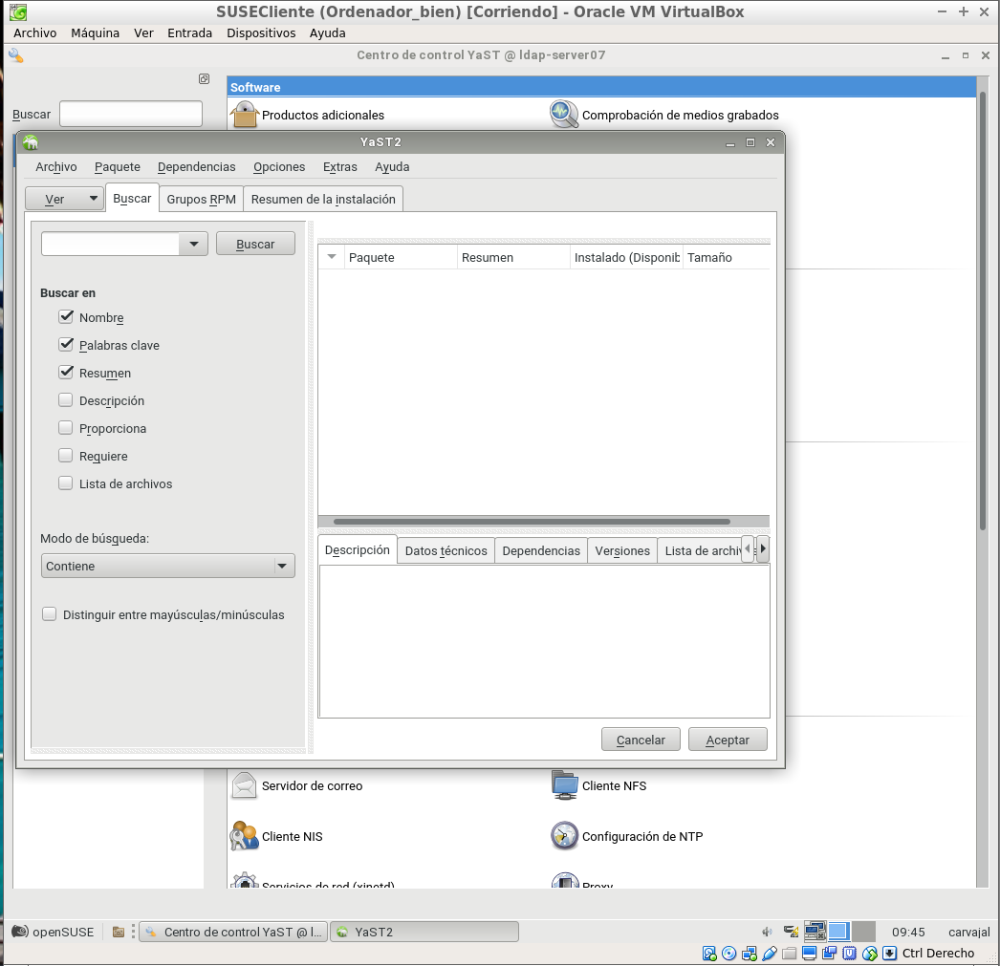
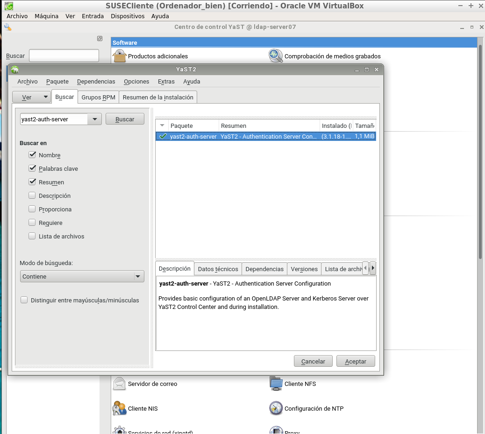
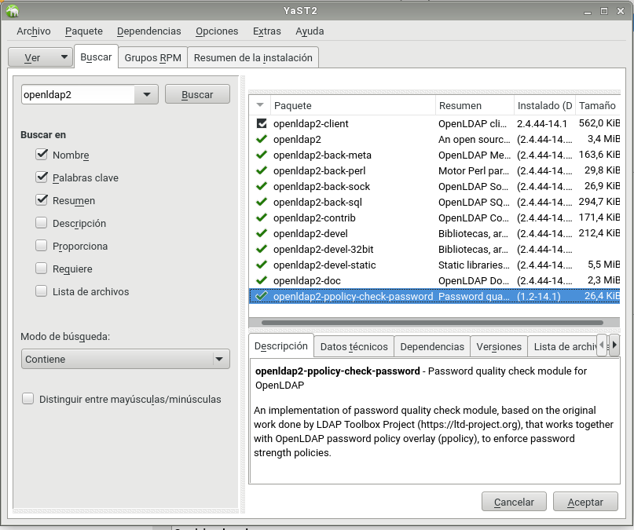
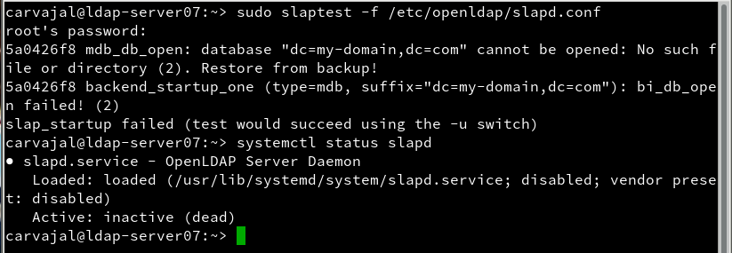
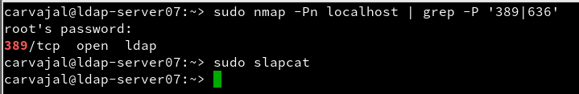
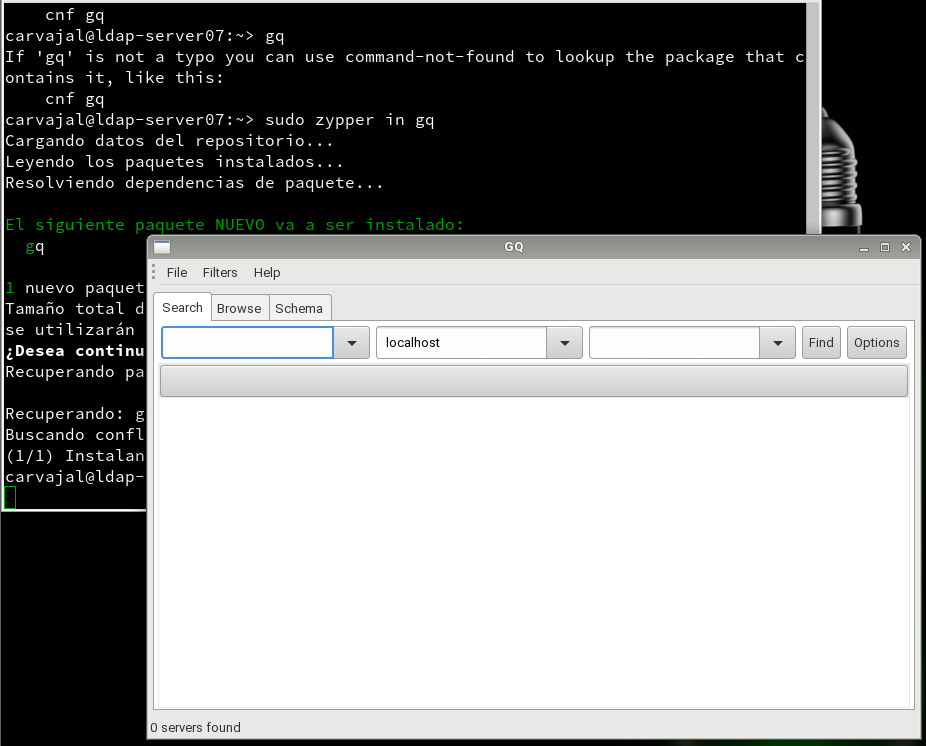
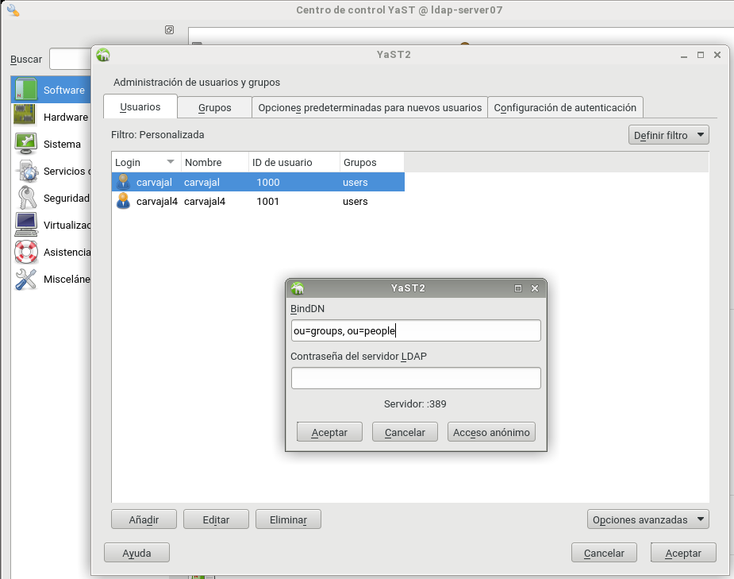
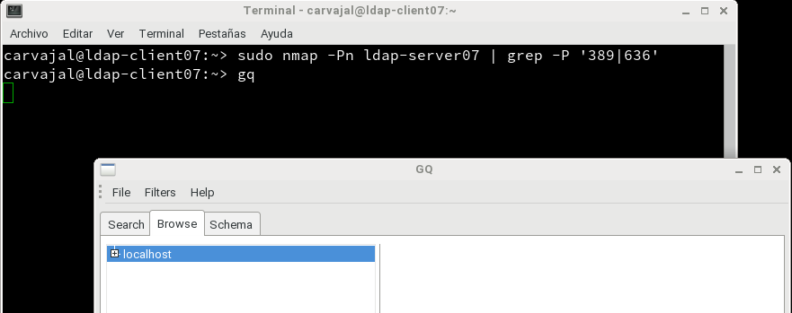

# LDAP

Comenzaremos yendo a `Yast -> Productos adicionales -> Gestor` e instalaremos los paquetes `yast2-auth-server, openlapd2, krb5-server, krb5-client`.

Una vez instalados debemos ir a `Yast -> LDAP` y configurar como en la imagen siguiente.

Ahora insertaremos unos comandos para verificar que todo funciona con exactitud.

Terminada esa verificación, procederemos a instalar una herramienta gráfica del lapd llamada `gq`.

Nos dirigimos a `Yast -> Usuarios y grupos -> Definir filtro -> LAPD` e insertamos clientes que aparecerán en la pantalla del gq.

Desde la máquina del cliente podemos hacer ciertas comprobaciones para establecer conexión con el servidor.

