# LDAP - OpenSuse

## 1. Servidor LDAP

#### 1.1 Preparar la máquina.

Haremos las configuraciones naturales de cada práctica cambiando el nombre del equipo y configurando nuestra información en **hosts**.

#### 1.2 Instalación del Servidor LDAP.

Comenzaremos yendo a `Yast -> Productos adicionales -> Gestor` e instalaremos los paquetes `yast2-auth-server, openlapd2, krb5-server, krb5-client`.

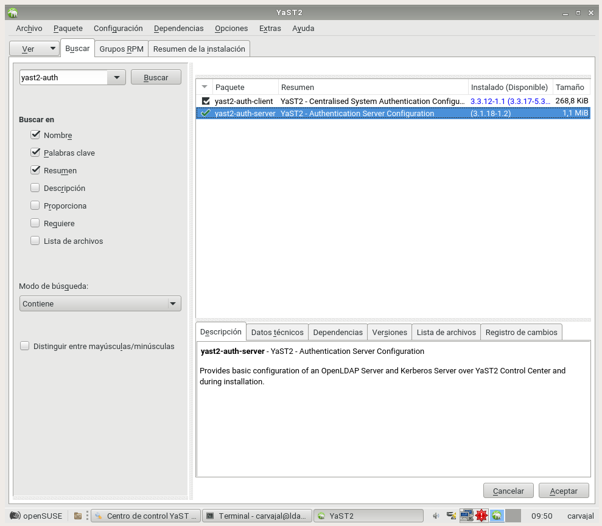

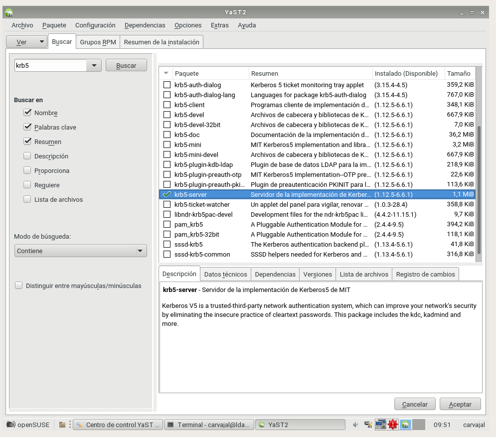

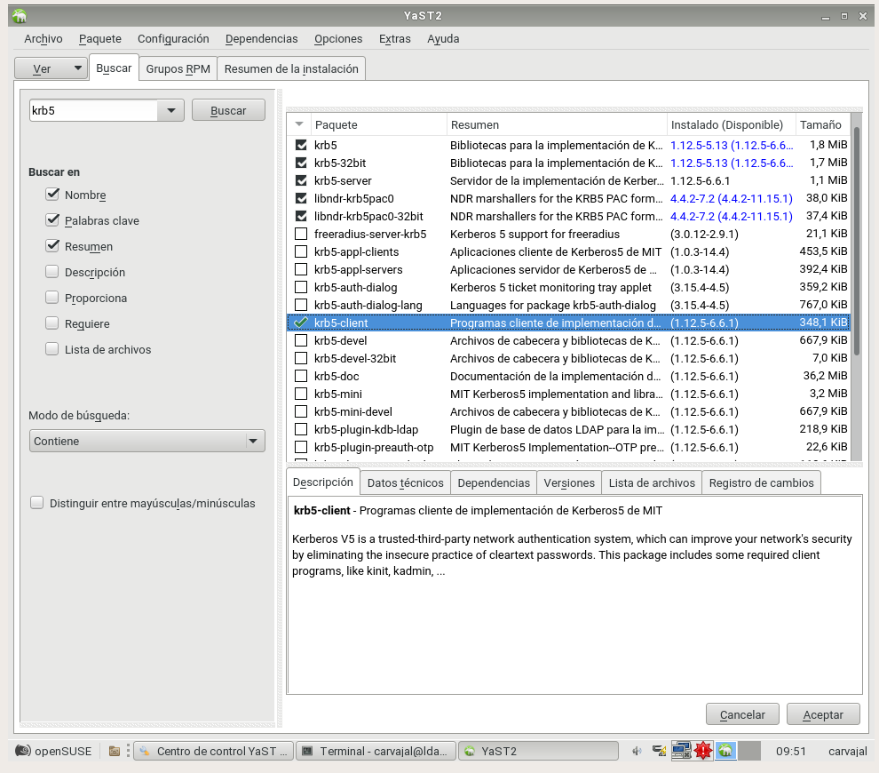

Una vez instalados debemos ir a `Yast -> Servidor de Autentificación` y configurar como en la imagen siguiente.

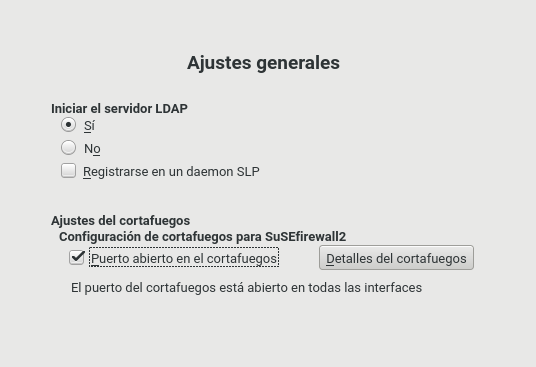

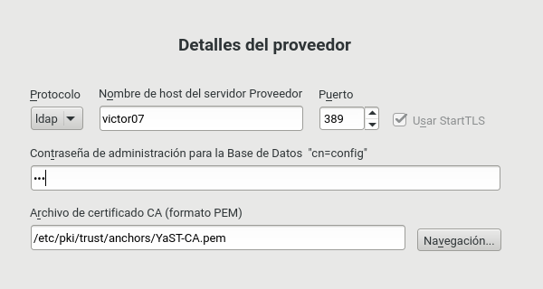

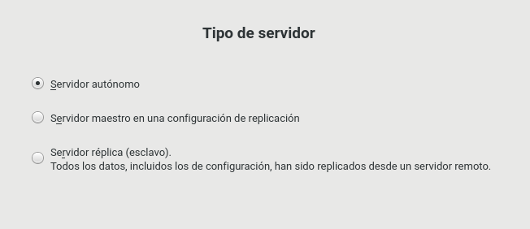

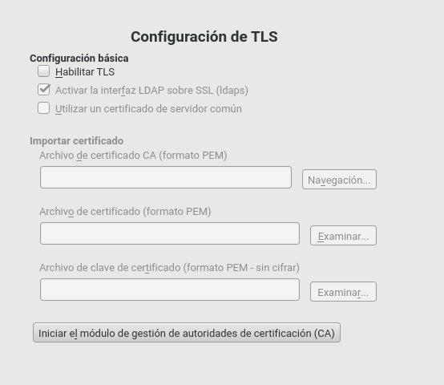

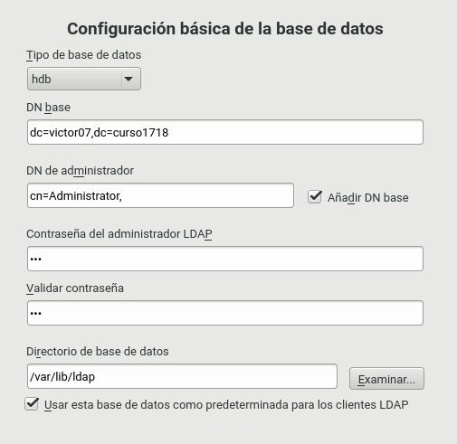

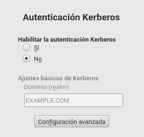

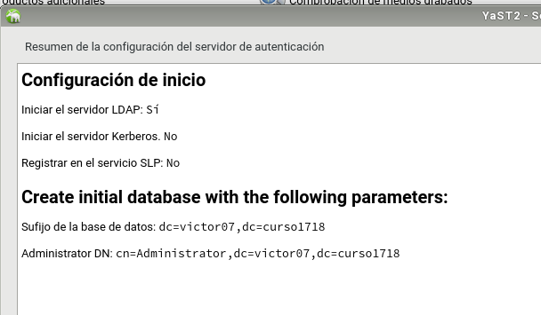

Ahora insertaremos unos comandos para verificar que todo funciona con exactitud.

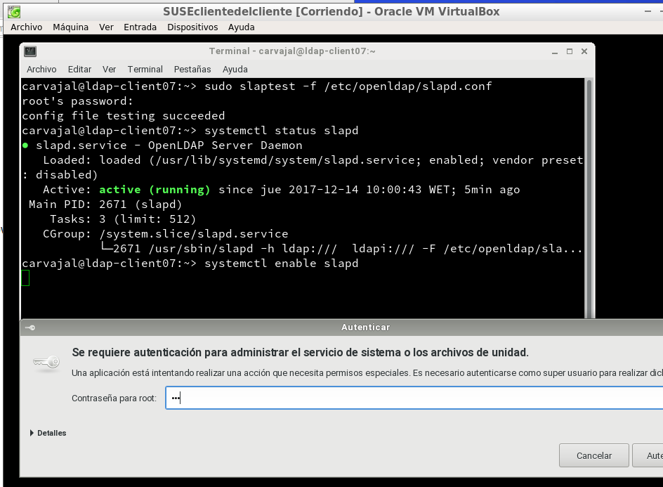

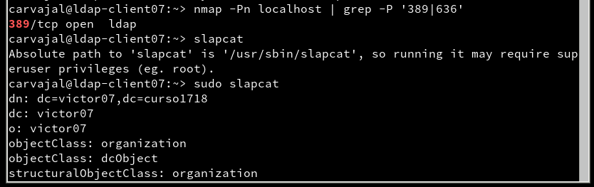

Terminada esa verificación, procederemos a instalar una herramienta gráfica del lapd llamada `gq`.

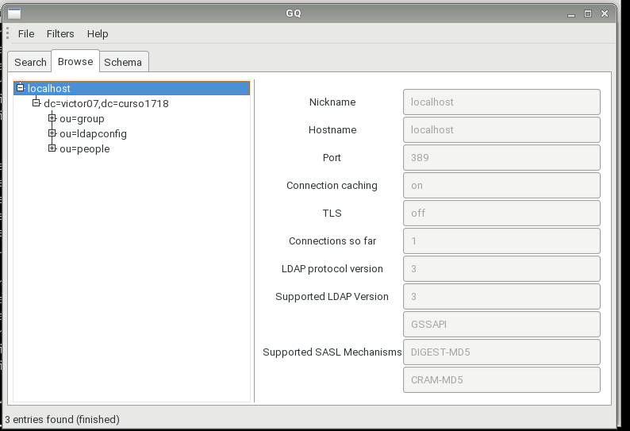

#### 1.3 Problemas

Si ocurrieran problemas a la hora de continuar la práctica debemos desinstalar todo lo anterior.

#### 1.4 Crear usuarios y grupos LDAP

Nos dirigimos a `Yast -> Usuarios y grupos -> Definir filtro -> LAPD` e insertamos clientes que aparecerán en la pantalla del gq.

Desde la máquina del cliente podemos hacer ciertas comprobaciones para establecer conexión con el servidor.

Vamos a la máquina del servidor y creamos con el filtro `LDAP` el grupo **piratas2** y los usuarios correspondientes como aparece en al imagen.

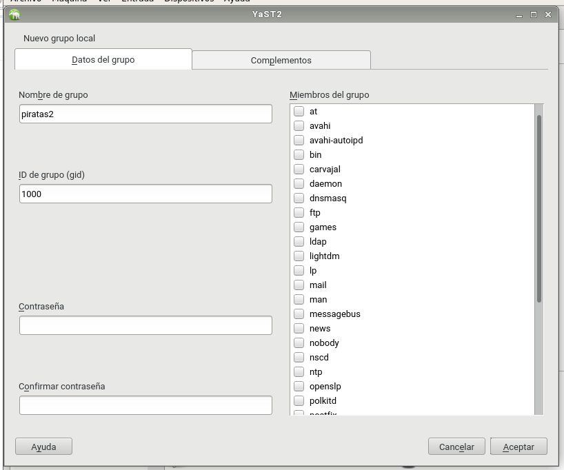

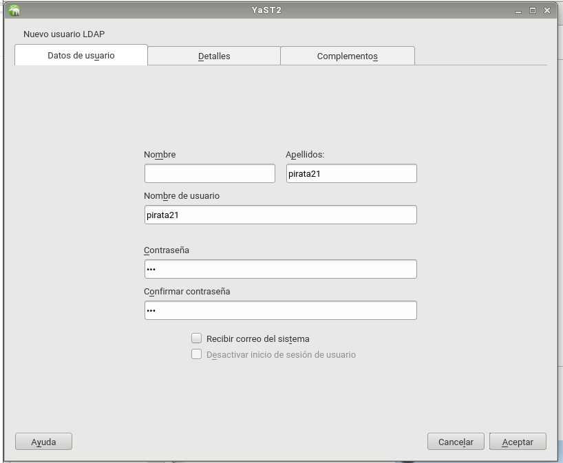

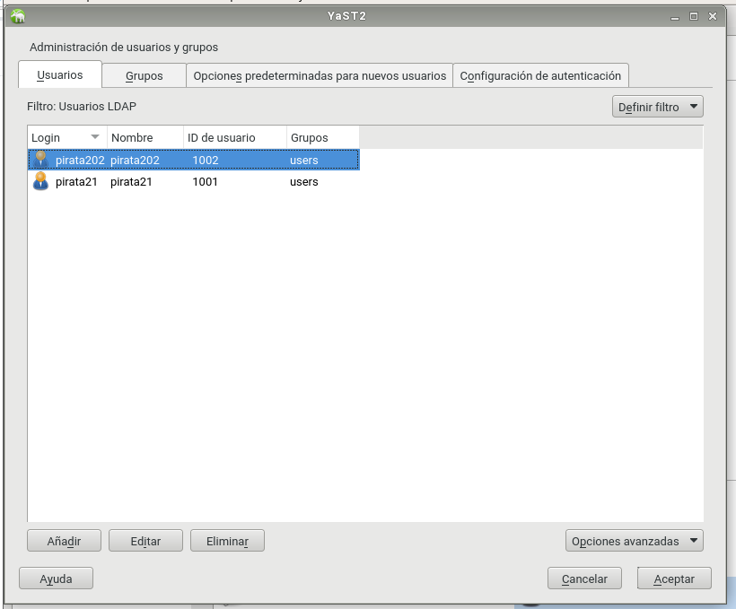

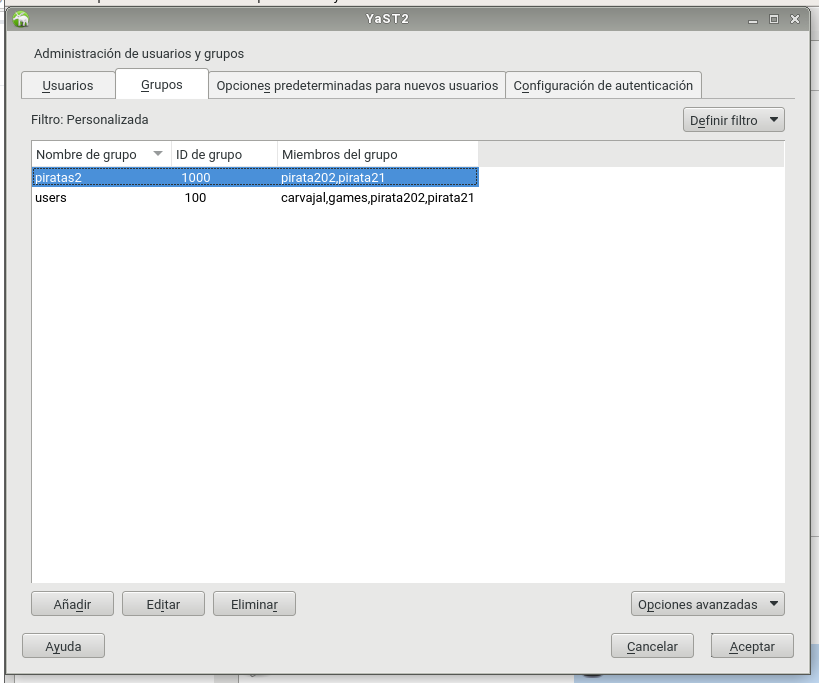

Con este comando a continuación consultamos la base de datos LDAP.

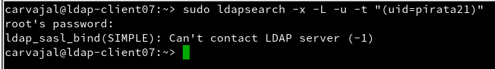

## 2. Cliente LDAP

A partir de este punto vamos a escribir información en el servidor LDAP.

#### 2.1 Preparativos

Vamos a otra máquina virtual OpenSUSE y la configuramos de manera que sea un cliente.

#### Comprobación

Comprobamos que el servidor LDAP es accesible para el cliente.

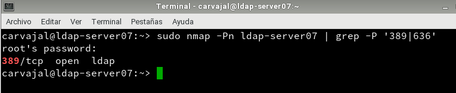

Una vez en el cliente, vamos a `Terminal -> gq -> Preferences` e insertamos los datos correspondientes.

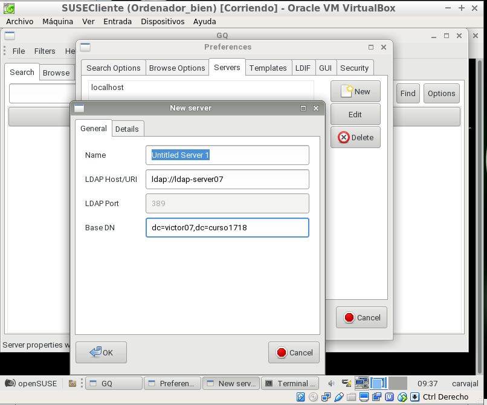

#### 2.2 Instalar cliente LDAP

`Yast -> LDAP and Kerberos -> Opciones` y configuramos como en la pantalla.

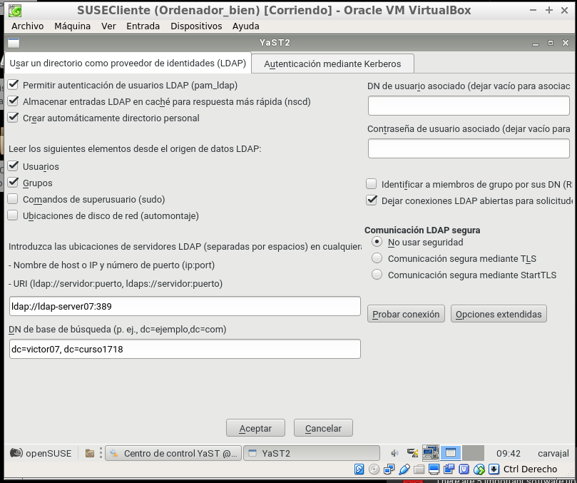

#### 2.3 Comprobamos desde el cliente

Últimas comprobaciones y observamos desde el cliente que funciona.

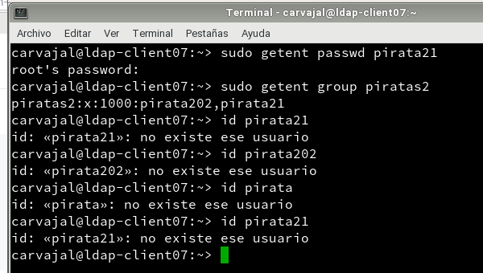

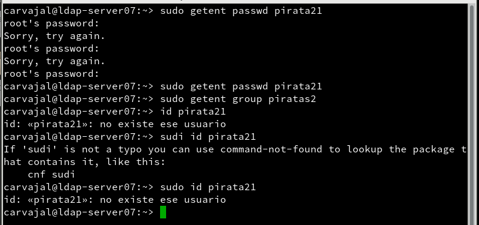

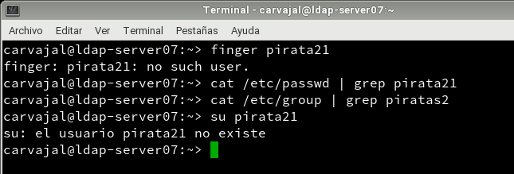

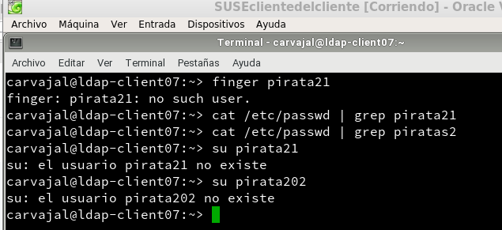

#### 2.4 Autenticación
