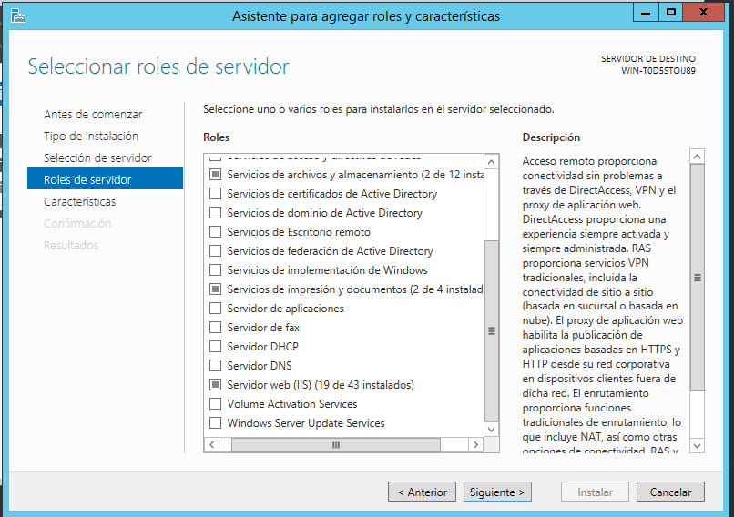
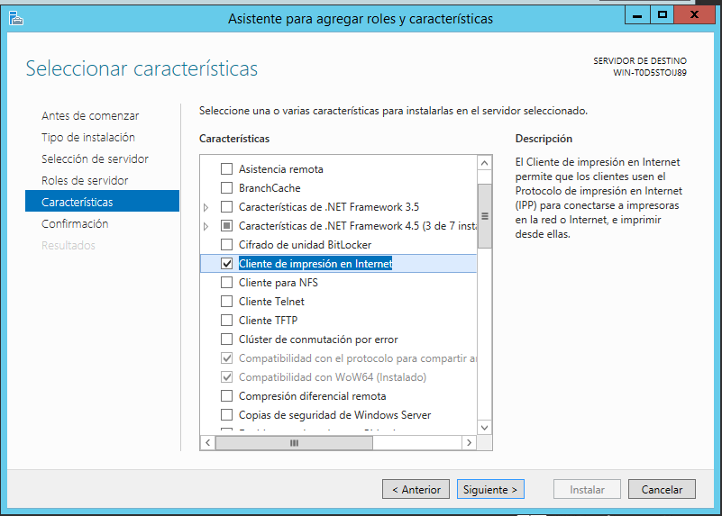
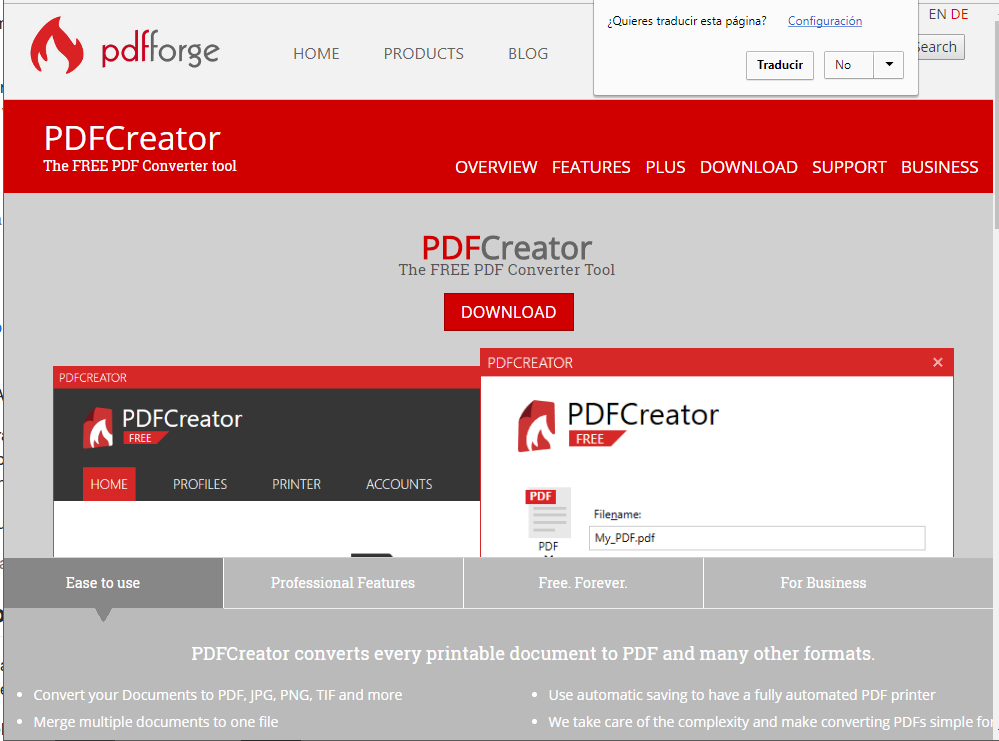
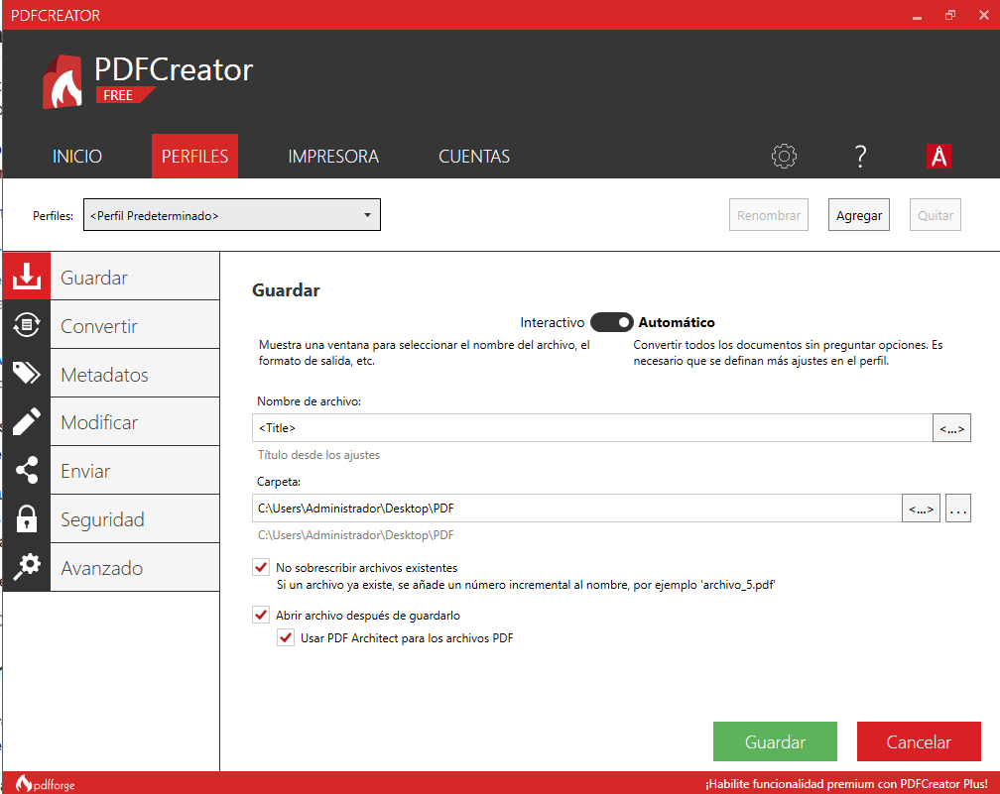
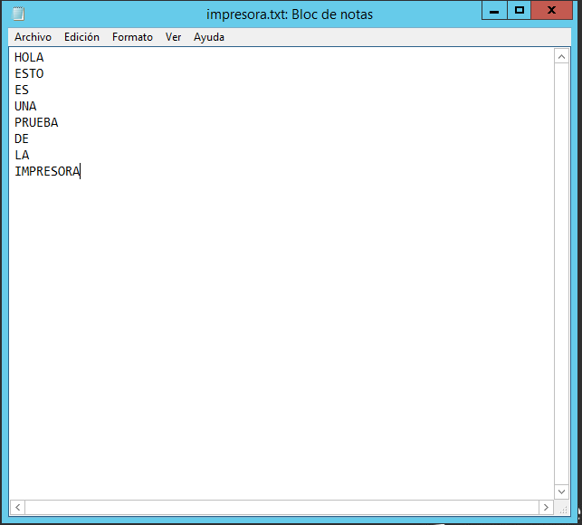
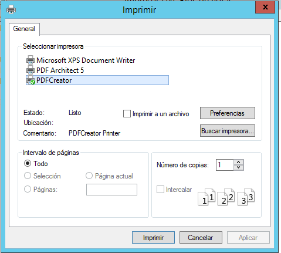
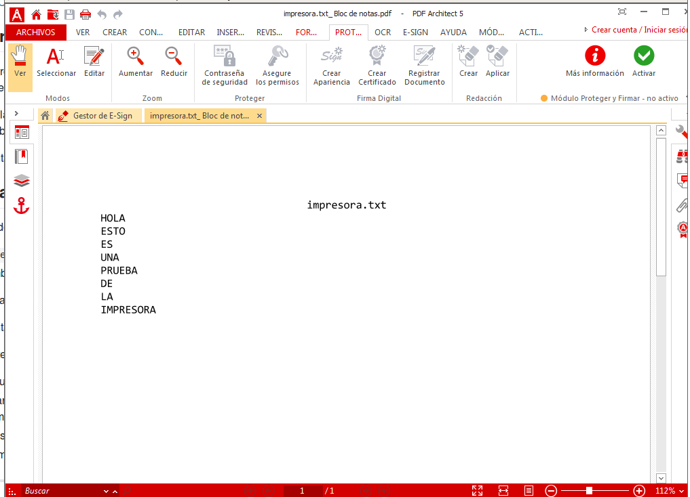
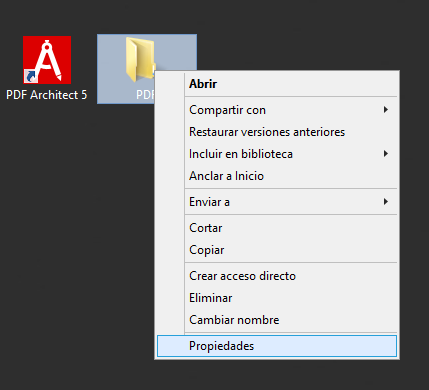
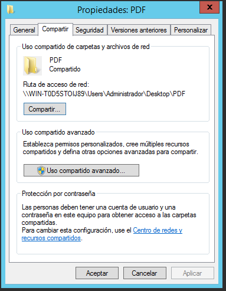

# PDFCreator

Necesitamos **Windows Server** y **Windows cliente**.

#### 1.1 Rol impresión

Vamos al servidor e instalamos el rol de impresión por Internet.

#### 1.2 Instalar impresora PDFCreator

Instalamos **PDFCreator**.

Vamos a `PDFCreator -> Ajustes -> Autoguardado` y elegimos la carpeta de destino de nuestros ficheros.

#### 1.3 Probar la impresora en local

Probamos la impresora e imprimimos un archivo cualquiera de un bloc de notas.

#### 1.4 Compartir por red

Vamos a nuestra carpeta donde alojamos los archivos guardados. `Botón derecho -> Propiedades -> Compartir`. Y le cambiamos el nombre a `PDFnombrealumnoXX`. Si no podemos cambiar el nombre es que no hay un usuario con ese nombre. Crearlo.

En el cliente debemos buscar la dirección del servidor.
