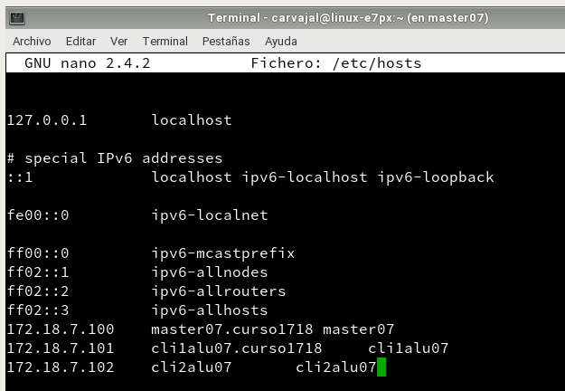
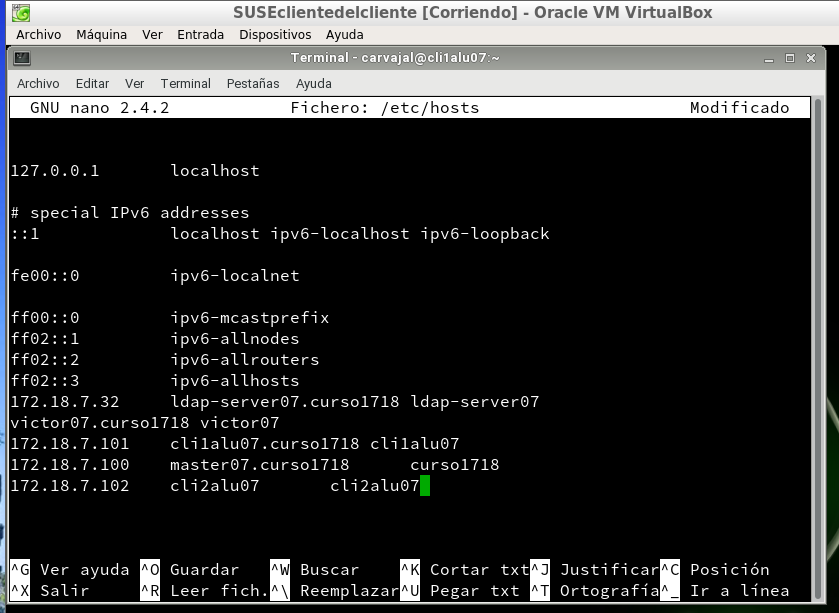
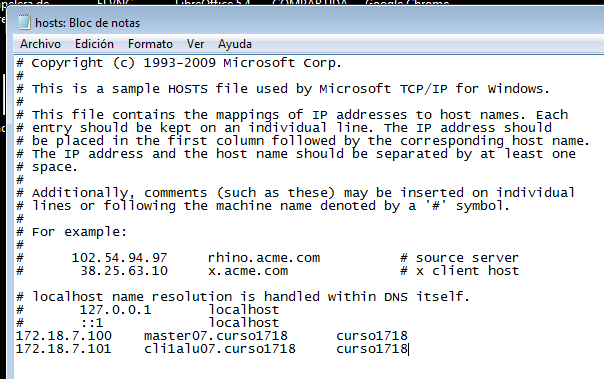

# Puppet

## 1. Introducción

Puppet es una herramienta diseñada para administrar la configuración de sistemas Unix-like y de Microsoft Windows de forma declarativa. El usuario describe los recursos del sistema y sus estados, ya sea utilizando el lenguaje declarativo de Puppet ó un lenguaje específíco de Ruby.

#### 1.2 Configuración

Usaremos tres máquinas virtuales:
* Master - **SUSE-Master**
* Cliente1 - **SUSEclientedelcliente**
* Cliente2 - **Windows7**

#### Configurar /etc/hosts

Una vez configuradas las máquinas virtuales ahora debemos configurar sus `hosts` para poder hacer ping entre ellas.

