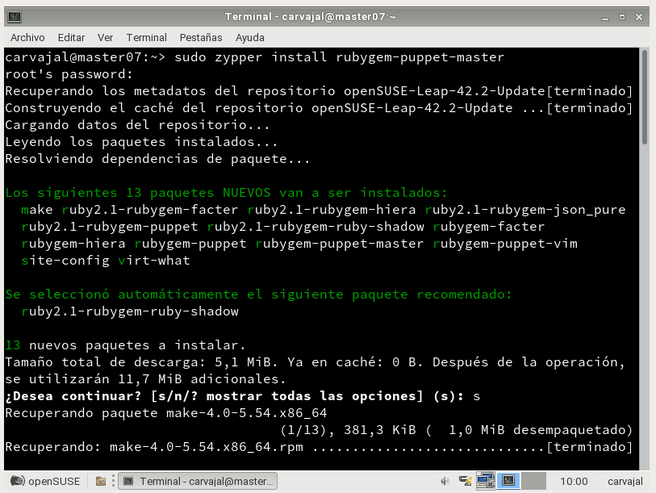

# Puppet

## 1. Introducción

Puppet es una herramienta diseñada para administrar la configuración de sistemas Unix-like y de Microsoft Windows de forma declarativa. El usuario describe los recursos del sistema y sus estados, ya sea utilizando el lenguaje declarativo de Puppet ó un lenguaje específíco de Ruby.

#### 1.2 Configuración

Usaremos tres máquinas virtuales:
* Master - **SUSE-Master**
* Cliente1 - **SUSEclientedelcliente**
* Cliente2 - **Windows7**

#### Configurar /etc/hosts

Una vez configuradas las máquinas virtuales ahora debemos configurar sus `hosts` para poder hacer ping entre ellas.

#### 1.3 Comprobar las configuraciones.

Con unos comandos propios de visualizar los datos de configuración sabremos si las máquinas virtuales están bien gestionadas.

## 2. Primera versión del fichero pp.

El primer paso es instalar el Puppet Master en la máquina `master`, nuestro OpenSUSE.

Comandos para gestionar el estado de Puppet.

Se crea automáticamente el fichero `etc/puppet/manifests`.

Preparamos los ficheros en esta carpeta para el siguiente paso.

#### 2.1 readme.txt

Escribimos en el `readme.txt` ya que los ficheros en los que se aloja pueden ser descargados desde el resto de máquinas clientes Puppet.

#### 2.2 site.pp

`manifests` es el fichero principal de configuración de órdenes para los agentes/nodos puppet. Debemos crear un `site.pp`.

#### 2.3 hostlinux1.pp

Creamos un archivo con este nombre en `/etc/puppet/manifests/classes/hostlinux1.pp`. Esto es, podemos tener muchas configuraciones vamos a organizar los ficheros y, por ello, lo guardamos en esta dirección.
