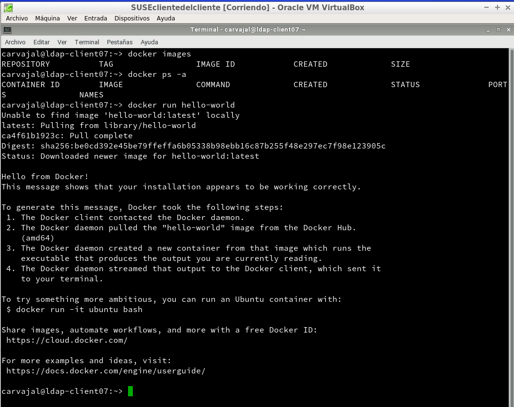

# Docker

## 1. Introducción

**Docker** es una tecnología contenedor de aplicaciones construida sobre LXC.

## 2. Requisitos

Para esta práctica vamos a usar la MV de OpenSUSE **SUSEclientedelcliente**. Además, debe tener
una versión de Kernel .10 o superior.

## 3. Instalación y primeras pruebas

*Ejecutamos como superusuario.*

*Salimos de nuestra sesión, volvemos a entrar para efectuar los cambios y comprobamos.*

## 4. Configuración de la red

**Habilitar acceso a la red externa a los contenedores.**

Es necesario este paso para que nuestro contenedor tenga acceso a la red exterior.

*Y reiniciamos.*

#### 4.1 Más comandos

Diferentes comandos útiles para nuestro proyecto.

## 5. Crear un contenedor manualmente

Crearemos un contenedor Debian8 y, dentro, Nginx.

#### 5.1 Crear una imagen

*Crearemos un contenedor a partir de la imagen debian:8 y ejecutamos bin/bash.*

**PROBLEMAS CON AL APT-GET NO SE ABRE EL DOCKER**

