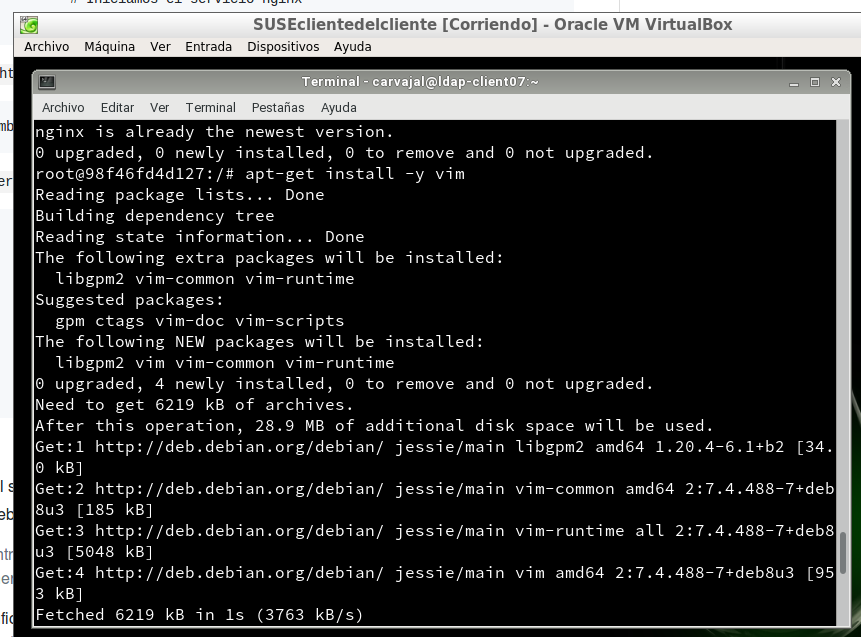
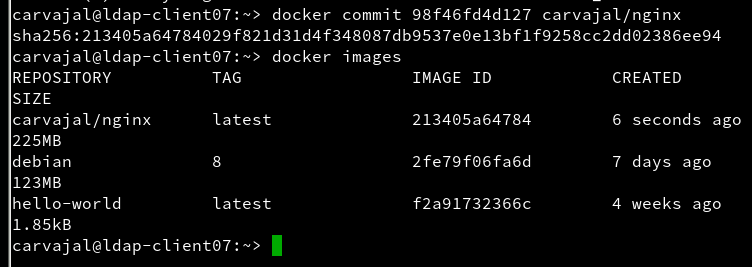
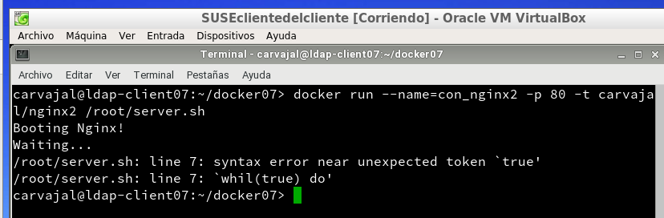

# Docker

## 1. Introducción

**Docker** es una tecnología contenedor de aplicaciones construida sobre LXC.

## 2. Requisitos

Para esta práctica vamos a usar la MV de OpenSUSE **SUSEclientedelcliente**. Además, debe tener
una versión de Kernel .10 o superior.

## 3. Instalación y primeras pruebas

*Ejecutamos como superusuario.*

*Salimos de nuestra sesión, volvemos a entrar para efectuar los cambios y comprobamos.*

## 4. Configuración de la red

**Habilitar acceso a la red externa a los contenedores.**

Es necesario este paso para que nuestro contenedor tenga acceso a la red exterior.

*Y reiniciamos.*

#### 4.1 Más comandos

Diferentes comandos útiles para nuestro proyecto.

## 5. Crear un contenedor manualmente

Crearemos un contenedor Debian8 y, dentro, Nginx.

#### 5.1 Crear una imagen

*Crearemos un contenedor a partir de la imagen debian:8 y ejecutamos bin/bash.*

**PROBLEMAS CON AL APT-GET NO SE ABRE EL DOCKER**

La solución encontrada es `systemctl restart docker`, `docker attach ID` `docker start ID`.

*Seguimos con la práctica entrando en nuestra mv e instalando el nginx y demás.*

Creamos un fichero HTML.

Ahora un script con el siguiente contenido en esta dirección.

*Es importante saber que este fichero debe tener permisos de ejecución.*

Ahora debemos abrir una nueva imagen con los cambios ya efectuados.

Aplicamos los cambios.

Por uĺtimo, insertamos comandos para actualizar nuestros cambios.

#### 5.2 Crear contenedor con Nginx

Iniciamos el contenedor de la siguiente manera.

Hecho esto abrimos una terminal y mostramos los contenedores en ejecución.

Abrimos un navegador para conectar con el servidor.

Paramos el contenedor y lo eliminamos

## 6. Crear un contenedor con Dockerfile

#### 6.1 Comprobaciones iniciales

#### 6.2 Preparar ficheros

Creamos el directorio `/home/carvajal/docker07` y ponemos dentro ciertos ficheros.

#### 6.3 Crear imagen desde el Dockerfile

El fichero Dockerfile tiene información para construir el contendor. Hacemos comprobaciones y creamos.

#### 6.4 Crear contenedor y comprobar

Creamos un contenedor a partir de la imagen que antes hemos creado y, además, haremos que ejecute el programa `server.sh`.

Ahora vamos a otra terminal para hacer más comprobaciones.

Vamos al navegador y vemos si podemos conectarnos.

## 7. Migrar las imágenes de docker a otro servidor

Ahora llevamos los contenedores docker a un nuevo servidor. Primero hacemos un backup.

Luego exportamos imagen docker a fichero.

Importamos imagen docker desde fichero.

## 8. Limpiar

Para terminar, paramos los contenedores y los destruimos.
