# Tareas programadas

En esta práctica vamos a necesitar una máquina Windows y otra que es Linux.

Máquinas a utilizar:

Windows - **Windows7**

Linux - **SUSE-Master**

## 1. Windows - Tarea diferida

Configuramos la máquina Windows.

Programaremos una tarea diferida para que nos muestre un mensaje en pantalla. Para hacer esto, vamos a `Panel de control -> Herraminetas administrativas -> Programador de tareas`.

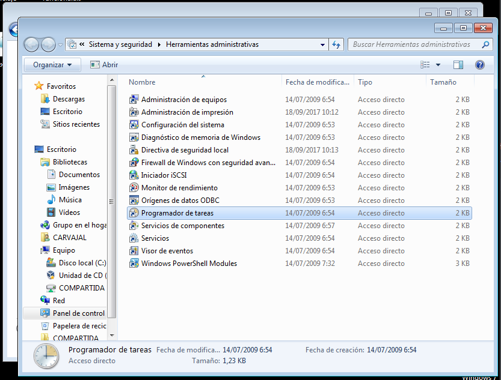

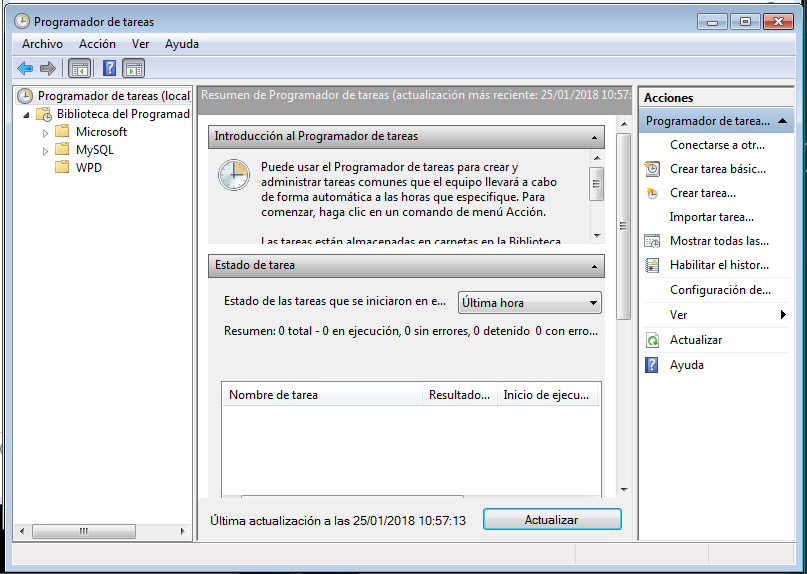

Creamos una tarea para ahora mismo.

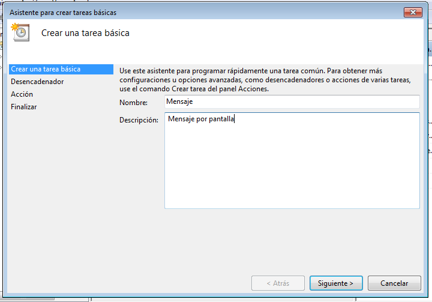

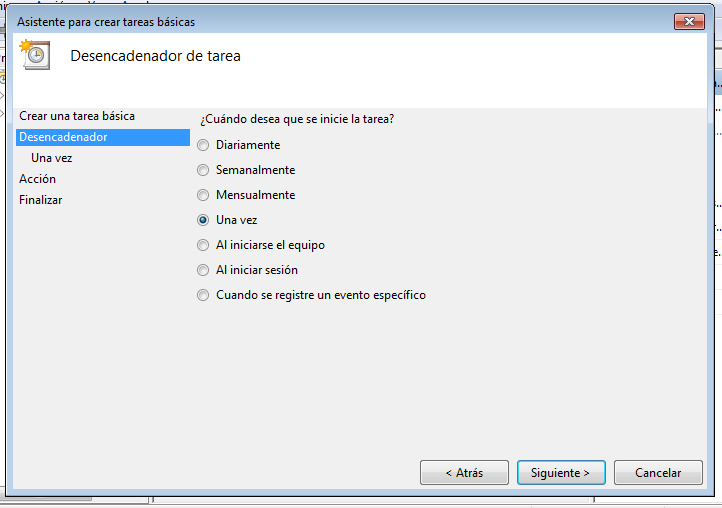

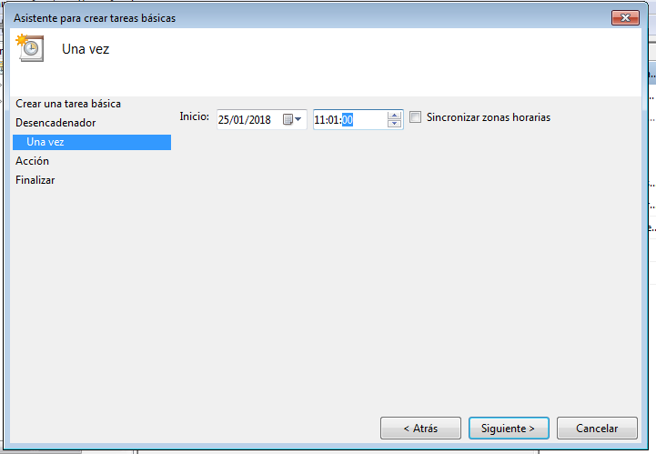

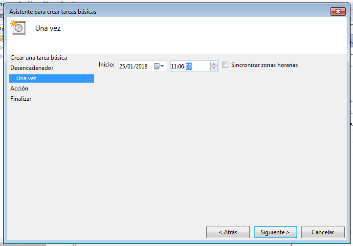

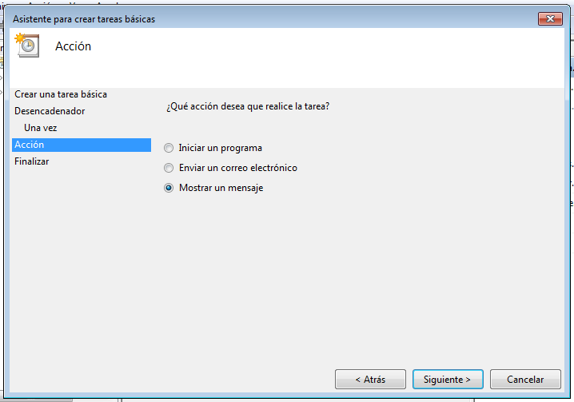

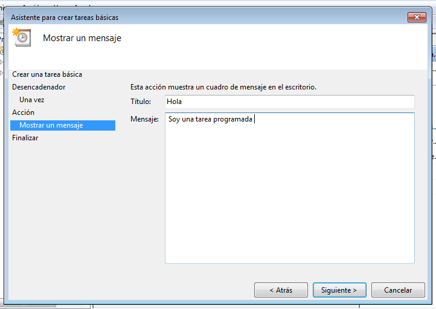

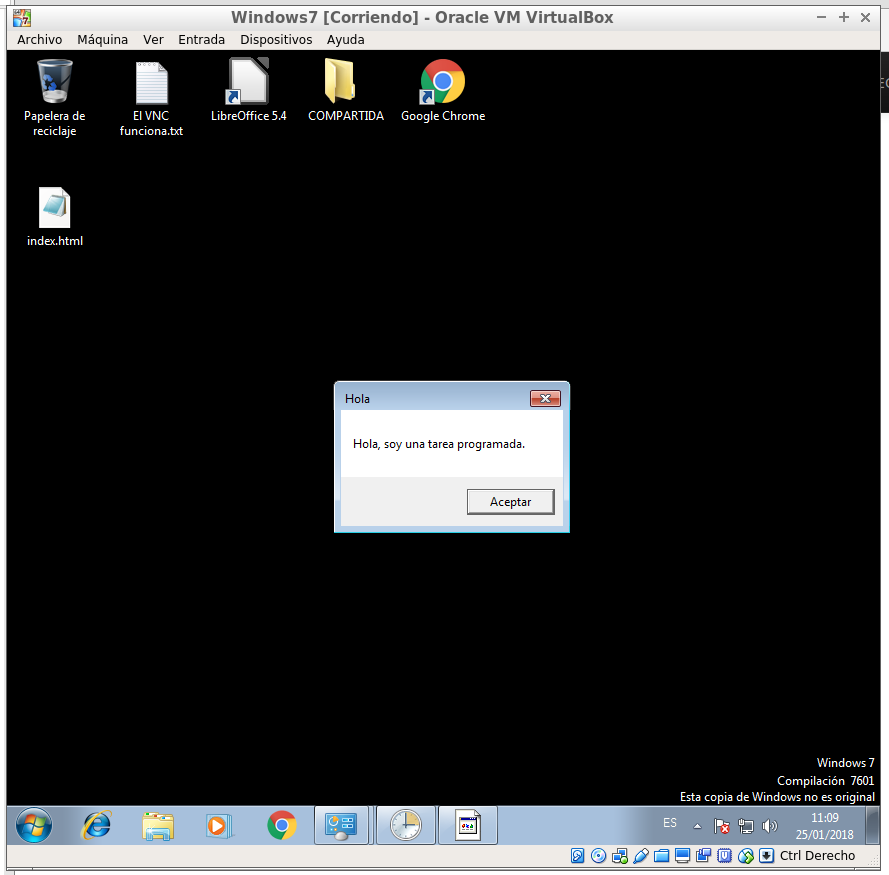

Esta ha sido una tarea para abrir un mensaje. El siguiente es abrir automáticamente una hoja de texto.

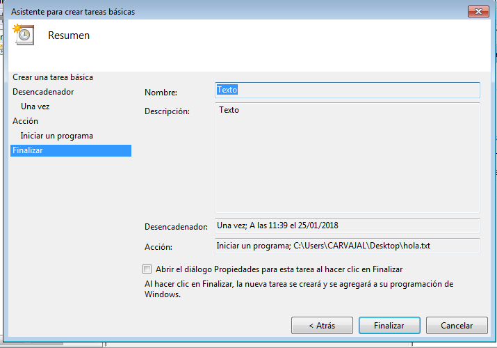

El último por probar será abrir el Google Chrome.

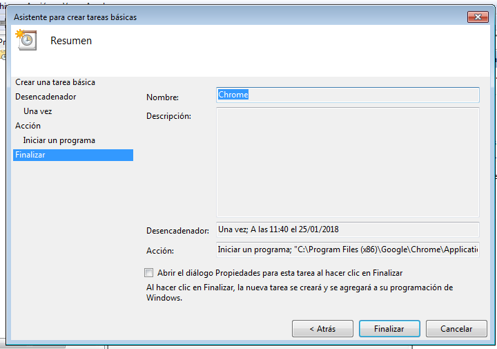

## 2. Windows - Tarea periódica

Una tarea periódica se ejecuta cada cierto período de tiempo. En esta tarea vamos a programar el apagado del equipo.

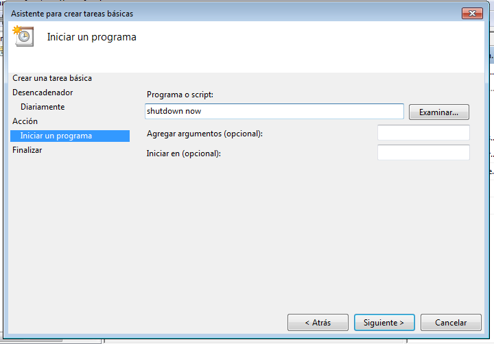

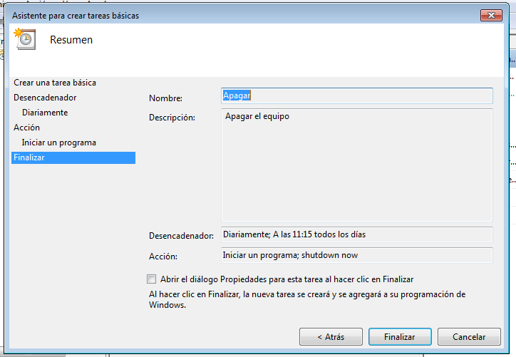

## 3. Linux - Tarea diferida

Vamos a hacer lo mismo con Linux - OpenSUSE.

Siguiendo los siguientes comandos de OpenSUSE...

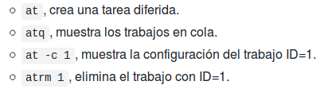

... vamos a crear un script. Para ello, creamos primero el mensaje que nos va a salir por pantalla cuando se ejecute.
