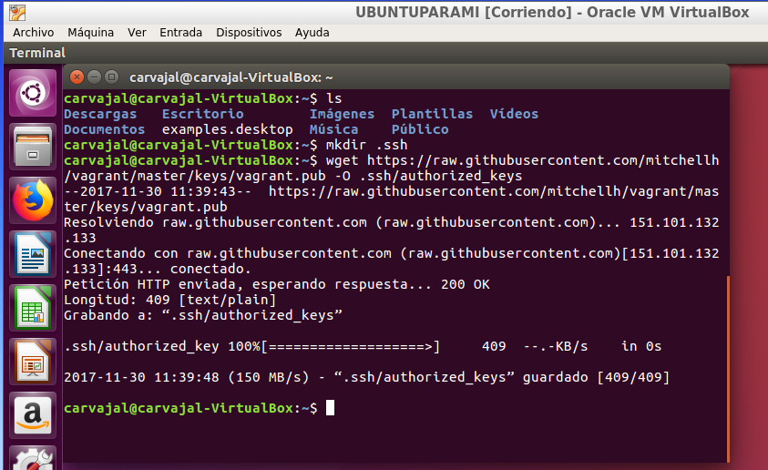
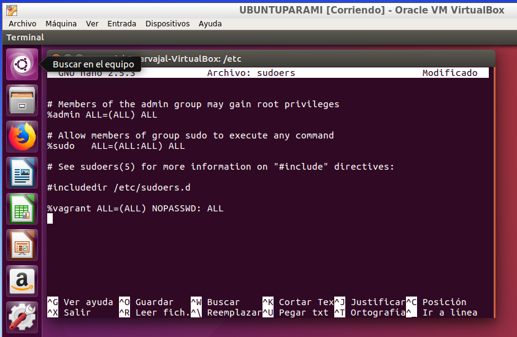

# Vagrant y Virtual Box

Vagrant es una herramienta para la creación y configuración de entornos de desarrollo virtualizados. Vamos a usar **Ubuntu** para esta práctica.

## 2. Primeros pasos
#### 2.1 Instalar

Procedemos a instalar **Vagrant**. El profesor dará las instrucciones necesarias.

#### 2.2 Proyecto

* Creamos un directorio para nuestro proyecto.

#### 2.3 Imagen, caja o Box

* Necesitamos una imagen para nuestro **Vagrant**.

* Ahora debemos modificar el archivo `Vagrantfile` para poder usar una caja determinada.

*Se puede trabajar mejor con el archivo quitando las lineas comentadas*

#### 2.4 Iniciar una nueva máquina

* Iniciamos una nueva máquina virtual usando **Vagrant** siguiendo estos pasos.

*Comandos útiles de Vagrant*

## 3. Configuración del entorno virtual

#### 3.1 Carpetas sincronizadas

* Identificamos las carpetas compartidas entre la máquina virtual y la máquina real.

#### 3.2 Redireccionamiento de los puertos

* Hay que configurar el enrutamiento de puertos. Si hubiera problemas para descargar **apache2** debemos hacer `sudo apt-get update`

* Modificamos **Vagrantfile** para ue el puerto 4567 del sistema anfitrión sea enrutado al puerto 80 del ambiente virtualizado.

* Hacemos unos comandos para confirmar los cambios realizados.

* Ahora comprobamos si funciona.

## 4. Ejemplos de configuración Vagrantfile

Información para configurar Vagrantfile.

* **Configurar la red** -> config.vm.network "private_network", ip: "192.168.33.10"

* **Configurar carpetas compartidas** -> config.vm.synced_folder "htdocs", "/var/www/html"

* **Configurar conexión SSH** -> config.ssh.username = "root"

config.ssh.password = "vagrant"

config.ssh.insert_key = "true"

* **Ejecución remota de aplicaciones gráficas** -> config.ssh.forward_agent = true

config.ssh.forward_x11 = true

## 5. Suministro

#### 5.1 Suministro mediante shell script

* Creamos el script `install_apache.sh` dentro del proyecto para instalar Apache. Vamos a nuestra carpeta de Vagrant y lo hacemos ahí.

* Dar permisos de ejecución.

* Vamos a **Vagrantfile** y agregamos la siguiente línea.

* Hecho esto creamos de nuevo nuestra MV y hacemos `vagrant reload` para que se ejecuten los comandos de nuestro script.

* Vamos a nuestro navegador y vemos que ha funcionado.

#### 5.2 Suministro mediante Puppet

* Ahora iremos a nuestro archivo de Vagrantfile y haremos lo siguiente.

* Ahora creamos un fichero con las órdenes puppet para instalar nmap. Crear una carpeta `manifests` y ahí crear el archivo.

 

 * Hecho esto hay que aplicar los cambios en la máquina virtual. `vagrant reload` y `vagrant provision`.

## 6. Nuestra caja personalizada

Ahora vamos a crear nuestra propia caja.

#### 6.1 Preparar la MV Virtualbox

* Usaremos una MV que ya tenemos e instalaremos en ella el OpenSSH.

* Crear el usuario Vagrant para poder entrar en la máquina virtual por SSH.

* Debemos configurar `/etc/sudoers` para que no nos solicite la contraseña de root.

#### 6.2 Crear la caja vagrant

* Creamos la carpeta con la nueva caja que vamos a crear.

* Localizamos el nombre de nuestra MV.

* Creamos la caja de nuestra máquina Vagrant y visualizamos que se ha creado.

