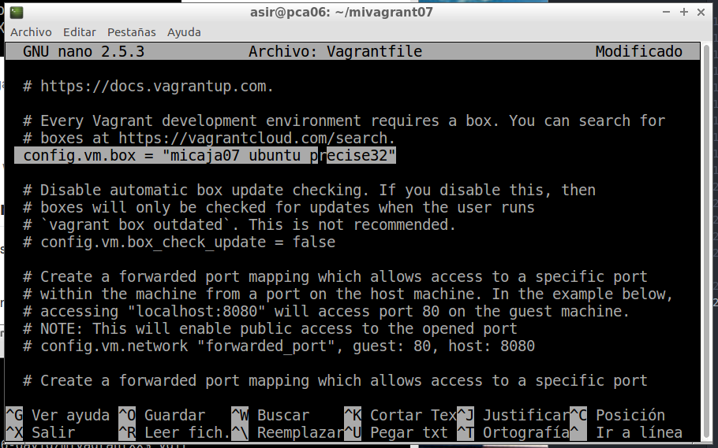

# Vagrant y Virtual Box

Vagrant es una herramienta para la creación y configuración de entornos de desarrollo virtualizados. Vamos a usar **Ubuntu** para esta práctica.

## 2. Primeros pasos
#### 2.1 Instalar

Procedemos a instalar **Vagrant**. El profesor dará las instrucciones necesarias.

#### 2.2 Proyecto

* Creamos un directorio para nuestro proyecto.

#### 2.3 Imagen, caja o Box

* Necesitamos una imagen para nuestro **Vagrant**.

* Ahora debemos modificar el archivo `Vagrantfile` para poder usar una caja determinada.

*Se puede trabajar mejor con el archivo quitando las lineas comentadas*

#### 2.4 Iniciar una nueva máquina

* Iniciamos una nueva máquina virtual usando **Vagrant** siguiendo estos pasos.

*Comandos útiles de Vagrant*

## 3. Configuración del entorno virtual

#### 3.1 Carpetas sincronizadas

* Identificamos las carpetas compartidas entre la máquina virtual y la máquina real.

#### 3.2 Redireccionamiento de los puertos

* Hay que configurar el enrutamiento de puertos. Si hubiera problemas para descargar **apache2** debemos hacer `sudo apt-get update`

* Modificamos **Vagrantfile** para ue el puerto 4567 del sistema anfitrión sea enrutado al puerto 80 del ambiente virtualizado.

* Hacemos unos comandos para confirmar los cambios realizados.

* Ahora comprobamos si funciona.

